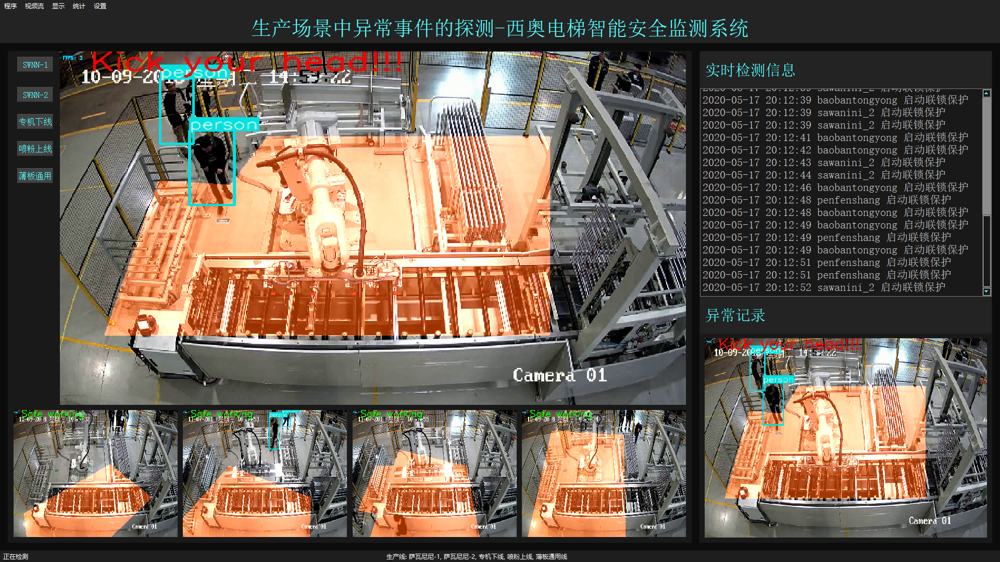
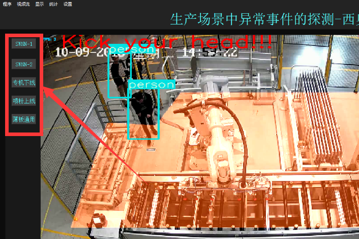
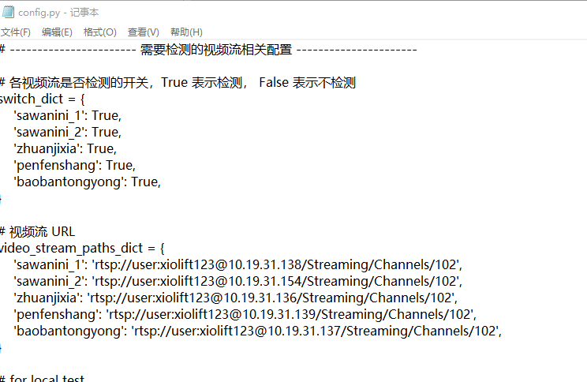
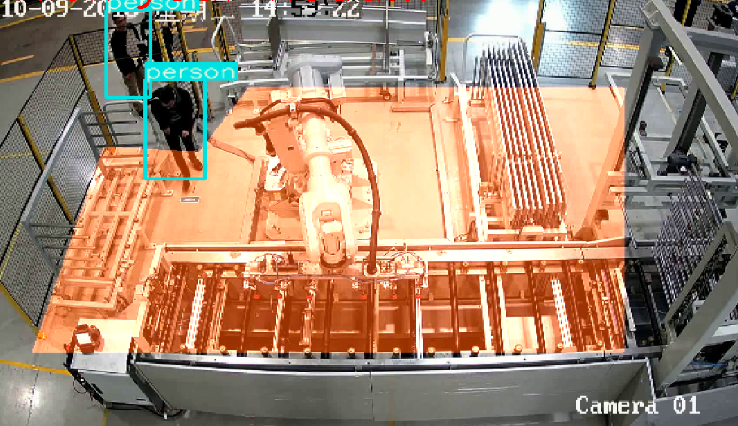
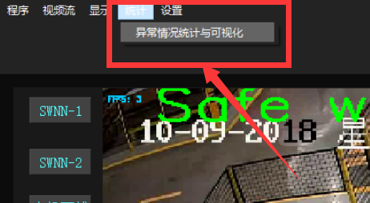
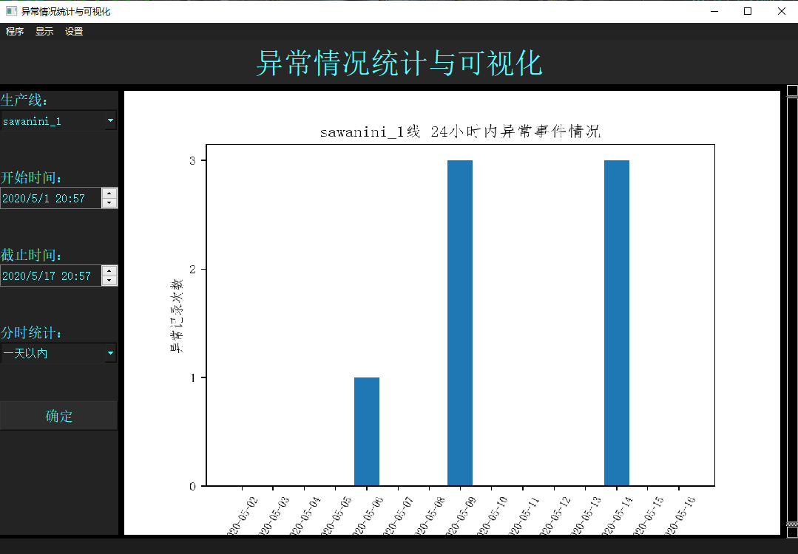
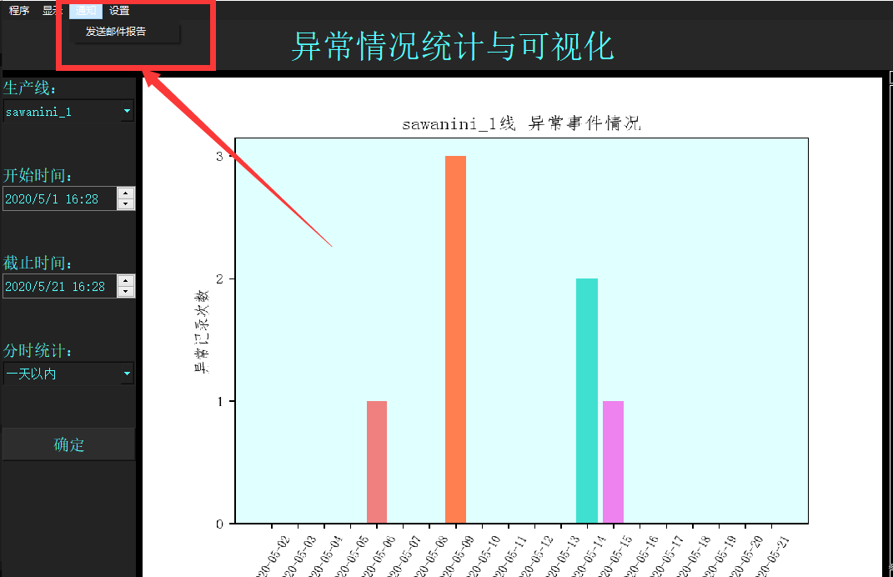
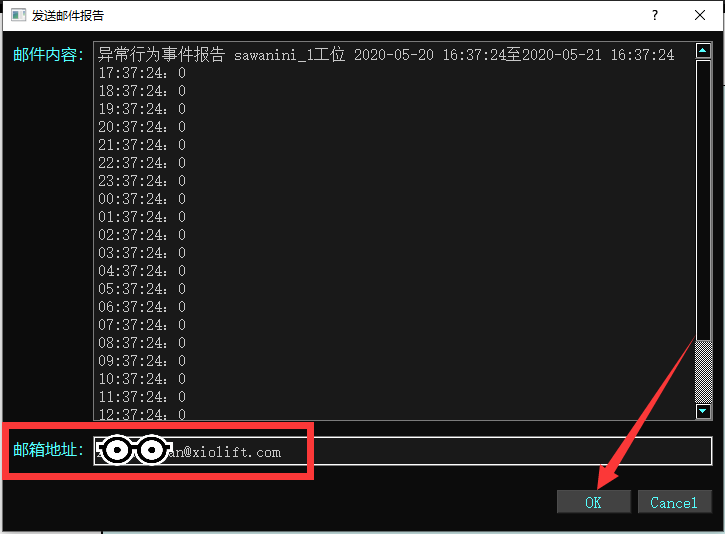

# 生产场景中异常事件的探测（西奥电梯安全监测系统）
## 多生产场景的视频实时读取与可视化
视频实时检测界面：

双击系统图标，启动系统，自动读取西奥电梯生产车间内多个工位摄像头的实时视频数据，进行人员异常行为事件的探测，将实时的检测结果和信息绘制并滚动显示在系统界面上。界面的左边部分显示各个工位的检测实况，右边部分分别滚动显示实时检测信息和最近一次出现人员异常行为的图像记录。

点击系统界面右上角的按钮，用来切换大屏显示的工位。

点击系统界面上菜单栏“设置”-“打开配置文件”，即可通过记事本打开系统属性的设置文件，在文件中通过修改视频流相关属性，即可以切换系统检测的工位摄像头。

## 异常事件的实时探测
系统通过深度学习目标检测技术，自动地对生产车间内人员的异常行为事件进行实时检测，并在将人员异常情况绘制显示在系统界面视频栏中。

## 生产过程的实时控制
当系统探测到在某个工位上发生人员异常行为事件时，将立即做出响应，对人员启动连锁保护程序，紧急停止机器运转，发出报警信号。等待系统检测到人员离开危险区域后，解除连锁保护程序，允许机器恢复正常运转。

## 异常事件的统计与可视化

点击系统菜单栏中“统计”-“异常情况统计与可视化”，即可打开系统对生产车间内历史异常记录的统计与可视化界面。在界面的左边部分分别选择和输入生产线、统计开始时间、统计截止时间和分时段统计选项，点击确定按钮，界面即显示出该生产线工位，各时段异常时间出现的次数图形。

## 异常事件的报警与发送
点击菜单栏“通知”-“发送邮件报告”，即可打开发送异常事件报告的界面。

发送邮件报告界面的上方部分的文本框是系统生产的异常事件报告的内容，也就是将要作为邮件发送的内容，下方部分的框中填写要发送的邮箱地址，这里默认是西奥电梯公司工程管理部门相关人员的邮箱地址。点击“OK”按钮即可自动发送该邮件。
